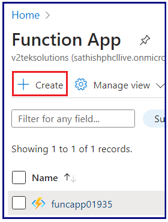
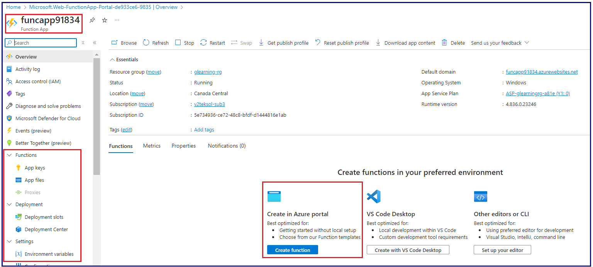

How To Create An Azure Function App that Calls an External 3rd Party API

Here we are going to xreate & use the Azure Function App with a .net app framework 

Let's deploy a an Azure Function App:

Login to Azure portal using the url  : 
Search for the Azure Function App from the Azure Universal search bar:

Select the Function App

Select the pricing modlea that you would like to use for your requirments. 
Please refer the Azure/ Microsoft URL to review the Function pricing model (https://azure.microsoft.com/en-in/pricing/details/functions/)

I am using the consumption model for this lab scnario.
Proceed to 'Next' for the Storage Configuration:

In this lab case, I am going to create the default storage account choice defined by Azure random name. However, you can create your selecte name for th same.

Proceed to 'Next' for the Network Configuration:

Here, the the Public access has been selected with as this is a lab. However, in the production environment, if the network to be isolated, you can select the public access to 'Off' and configure the Azure virtual network and the needed network CIDR range (of Cloud or On-prem etc.. Proceed to 'Next' for the 'Monitoring' Configuration:

The Monitoring option will create and configure an App insights storage account for the troubleshooting purpose.
Proceed to 'Next' for the 'Deployment' Configuration:

The 'Deployment' option is basically for deployment options with a DevOps/ CICD models. For now, I am continuing to a default setting as disabled.
Click on 'Review+Create' to submit the deployment.
With this option selected, the Function deployment process will show up the review detailed with all the option you have slectes in the previous sections (all) and you can have a final review in one page before you submit the configuration.

 Once the deployment is completed, you can see the deployment 'Overview' page as below:

Note: If you would like to download the configuration that you have finishe with this process, that you can download in a JSON file for the fututre reference and you can create similar fuctions with same comfiguration in the futire.

This lab has created with a code that test the Weather API from the url : https://weatherstack.com/

Pre-requisites:
What are the pre-requisites tha tyou should have for this to test:

Step-1:
Open the web link in any browser that supporte https://weatherstack.com/ (All latest browsers are compatible for this WebApp)

Step-2:
Sign up if you do not have an account in the site/ Login to the application if you have already signedup

Step-3:
Once you are login you will have an API Key (auto-generated), or you can also create your own API key as well.

Now, you are good with the pre-requisites to test the API with the created Azure function App.

Open the Azure Function App that created, Select the 'Create in Azure Portal' Option

Create a Fucntion with 'Http Trigger' option and click on 'Next'

Select the Template details As below: Function 'Name' & the 'Authorization Level' --> "you would like to" 

Select 'Anonymous' for the public access.

Once the Configuration is completed, there is a default funtion Code will be auto-generated with the language/ code framework that we selected. Here as we selected the .Net, there is a auto matic code that has generated with the same framework.

And there is a message showing in the console that you have connected to the Function App and the logs message appears in it. which represents the Azure fuction has succesfullt created.

Now, to test with the Weather API for the web application that we are intended to, 
Please replace the default code with you own code which you generated/ developed to interact with the Weather APP Web applicaiton
You can find the code here dotnet\WeatherAPI.csx

This code has Rewrote to define the variable with the API key to configure under the Fucntion App setting under the Environment variables to avoid exposing the API key as RAW in the program. Which is a Production scenario. 
Created a Key with 'WEATHER_API_KEY'

Below is the refeence point how the code is reading the Environment variable formt he App settings of the fucntion App.

Once the code is copied, Click on 'Test/Run/ option under 'Code+Test'. Now you would be popped up with the 'input'/ 'Output' section. 
Please provide the input in the Name & Value field.
The Name Section is 'Location' and the Value section is the country name (Canada etc.) here as per the program. I have pin pointed how the API code is reading the inputs.

Note: Please make sure you are deleting any JSON content under the Body before you 'Run' the test function.

Now, you can observe the Status code : 200 (OK) which is success communication to the Weather APP, and the information has retrieved as below for the countr or location that we have input

The Green highlited is the one exact Weather/ condition/ temporature that recorded/ read form the Weathershak website through an API and showed up here.